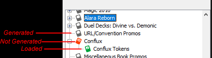
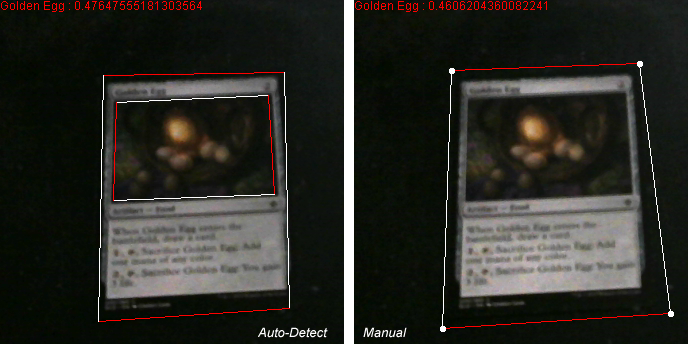
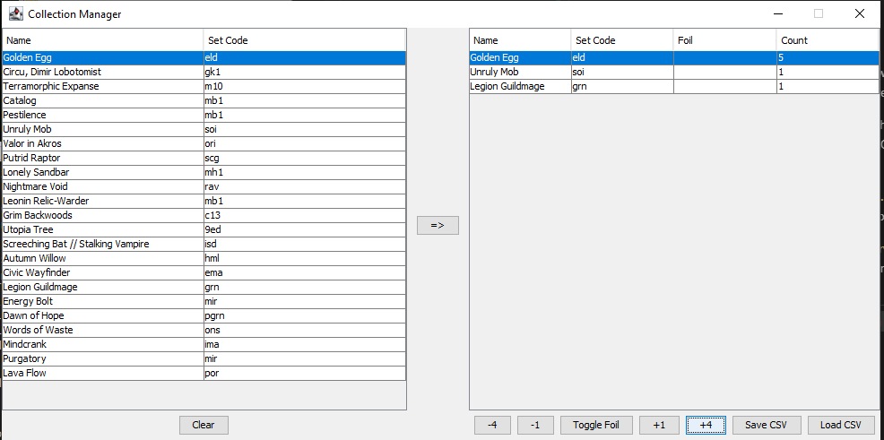

# About YamCR


YamCR is an open-source Magic The Gathering card recognizer, written in Java using BoofCV.

The current feature set is built toward collectors and paper Magic livestreamers.

It's partially written as a pet project, and partially as a tool with features that other recognizers lack.

## Setup

Extract the contents of the zip from the [release page](https://github.com/ForOhForError/Yet-Another-Magic-Card-Recognizer/releases/latest) to any directory on your machine.

Run the program by opening the file ```YamCR.jar``` with a Java runtime (version 8+). Windows users may use ```run.bat``` instead.

The first time the program launches, it will prompt you to select a path to save set and decklist files to. This can be any destination.

The total size of all set files so far is around 1.3 gigabytes at default settings, so choose a destination with some free space.

## Webcam selection

You will be prompted to choose a webcam device and resolution when the program first launches. The program may
repeat this prompt if the last used camera cannot be found, but it will attempt to respect your previous selection.

For users without a physical webcam, YamCR provides a simulated webcam input. This isn't especially useful for card recogmition, but it may prove useful for
using other features of the program.

YamCR also supports IP webcams. Configuration for these is specified in the ```webcam_settings``` -> ```ip_cams``` section of the programs config.json file.
IP webcams should each be an object in the array and specify ```"push"``` or ```"pull"``` as ```mode```, the video feed url as ```address```, and the display name as
```name```. A sample entry is shown below.

```json
...
"ip_cams": [
    {
        "mode": "pull",
        "address": "https://img.scryfall.com/cards/art_crop/front/9/0/90c7bea0-79c9-4856-8279-cef7cee82fc1.jpg?1562739519",
        "name": "Sample IP Webcam"
    }
],
...
```

## Generating Sets,  Custom Sets, and Decks

To recognize cards on the webcam feed, the program must process the features of each card.
This process requires an internet connection to [Scryfall's](https://scryfall.com) API,
as well as a fair amount of processing time. Note that set generation will pause card recognition
while it runs.

To generate sets in bulk, press the ```Bulk Generate Sets``` button on the sidebar of the program window.
A popup will display, giving a selection of the types of sets
that should be generated. Once the desired option is selected,
press the ```OK``` button to begin the set generation process.
Generation progress is shown at the bottom of the program window.

To generate custom sets, press the ```Create Custom Set``` button on the sidebar of the program window.
A popup will display, which provides instructions on generating a custom set from invidual card images.

To generate decklists, press the ```Deck Generator``` button on the sidebar of the program window.
A popup will display, giving an area to paste in a list of card names (one per line),
as well as a deck name. The decklist supports many of the plaintext formats exported from deckbuilding websites.
Once the desired cards are in the text area, the ```Generate Deck``` button can be used to generate a decklist file.

Note: Set files are generated from copyrighted images, and likely retain that copyright.
As such, please do not distribute set files.

## Loading sets and decklists

Any sets, custom sets, and decks can be seen in the settings pane, in the area below the function buttons. The ```Sets``` folder lists printed Magic sets,
```Decks``` lists generated decks, and ```Custom Sets``` lists custom sets.

Folders (and sets with sub-sets) can be expanded or collapsed via the "+/-" icon next to the set icon.



Sets marked with a red X icon are available to be generated. These can be generated by double-clicking the icon.

Sets marked with a gray icon are generated and can be loaded by double-clicking the icon.

Sets marked with a green checkmark icon are loaded and will be matched against during recognition.

Sets and decks can be unloaded by pressing the ```Unload all``` button, unloading all sets at once.

Multiple sets can be loaded at once by pressing the ```Load Selected``` button. This loads the selected set,
as well as any sub-sets (ex: tokens, promos).
For example, using this feature on the ```Sets``` folder icon will load all generated sets.
Depending on the amount being loaded, this may take some time.

Loading all existing sets at once (under default generation settings) should use about 2 gigabytes of memory.

## Recognition

Card recognition begins automatically when any number of sets or decks are loaded.

There are 2 modes for detecting cards in a scene:

* Under the ```Auto-Detect Card Bounds``` mode, YamCR attempts to identify the boundaries of cards in the image automatically. Under default settings, this works best against a solid-colored background.

  * If the ```Subtract Static Background``` option is enabled in the autodetect settings, cards will instead be detected purely on the difference from the background image, which can be set in the same menu. This option is currently experimental.

* The ```Manually Set Bounds``` mode allows manual selection of the recognition area. It can be moved by clicking and dragging on the corners of the polygon.
For useful results, the bounds must contain the full card and nothing else.



There are two modes for matching these detected cards:

* ```Full Scan``` attempts to score all cards using an accurate but slow algorithm. This will become unusably slow after multiple large sets are loaded.
However, it allows looser card bounds to be recognized accurately.

* ```Perceptual Hash Narrowing``` scores all cards using a fast, less accurate method, before using the above algorithm on the top matches. This allows real-time recognition against all existing Magic cards, but requires accurate
boundaries before the fast algorithm is reliable. Thus, it is mostly useful only
under auto-detected bounds.

The sidebar provides some options for refining recognition behavior:

* The ```Only trigger recognition manually``` checkbox can be used to disable automatic recognition. Instead, recognition will only be attempted when pressing any keyboard key after clicking the webcam area.

* The ```Score threshold``` slider determines how closely a match must "fit" to be accepted as a result. Turning this down will result in more matches, but may increase false positives.

## Collection Manager



The collection manager provides an interface for managing a collection listing as a csv file.

The left panel shows all cards recognized since launching the program. This list can be cleared
using the ```Clear``` button.

The right panel shows the current collection, which can be manipulated via the buttons below it. Note that while the program can save from and load to a csv file, the file is not auto-saved. Thus, changes made will be lost unless saved manually.

While the collection manager is intended to have a useful set of features, it is intentionally minimal in its functionality. Suggested enhancements can be submitted via the [Issues Page](https://github.com/ForOhForError/Yet-Another-Magic-Card-Recognizer/issues). Please tag suggestions under ```enhancement```.

## Browser Source

YamCR provides a browser source server to allow paper Magic livestreamers to display card images from within their streaming software.

The ```Browser Source``` button opens a panel for hosting the server. Options are included to set the address and port to bind to. Out of the box, there are 2 pages hosted:

* ```http://<address>:<port>/card-view.html``` shows the detected card image. For convience, a button is provided to copy this address to the clipboard.

* ```http://<address>:<port>/card-controller.html``` is a management panel, allowing drag-and-drop display of other images, as well as clearing the image/override.

The browser source pages are slightly modified versions of [Paul Saunder's Nifty-Recognizer](https://github.com/paul-lrr/nifty-recognizer).

Note: In addition to the listed port, the server binds to an arbitrary port to host the websocket interface.

## Other Functionality

The ```Card Preview``` button will create a popup that will display the image of any recognized cards. This is useful for checking results at a glance.
